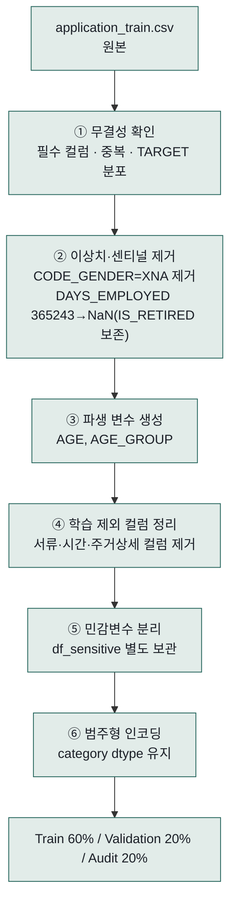

# 01. 데이터(Home Credit Default Risk) &amp; 모델 상세 설명

> 대상 저장소: `model-repo`(데이터 정제·모델 학습), `ai-repo`(모델·데이터 스키마 검증). 주니어 개발자가 "이 프로젝트에서 데이터가 어떤 모습이고, 어떻게 다듬어져서, 어떤 모델이 되는지"를 처음부터 따라올 수 있도록 작성했습니다.

---

## 1. 이 데이터는 무엇인가

**Home Credit Default Risk**는 Kaggle의 신용평가 대회 데이터셋입니다. 대출 신청자 한 명이 한 행이고, 목표는 "이 사람이 나중에 상환을 연체할 것인가"를 예측하는 것입니다. `model-repo`는 이 중 `application_train.csv`(공개 데이터셋 기준 약 30만 행, 122개 컬럼) 하나를 씁니다.

---

## 2. 컬럼 설명

### 2-1. 코드에 실제로 이름이 등장하는 컬럼 (근거: `model-repo/credit_scoring_model_training.ipynb`)

| 컬럼명 | 의미 | 이 프로젝트에서의 역할 |
|---|---|---|
| `SK_ID_CURR` | 대출 신청 건의 고유 식별자 | ID. 학습 피처 아님, 결과 추적용으로만 사용 |
| `TARGET` | 정답 — 0: 정상 상환, 1: 연체 | 모델이 맞혀야 하는 값 |
| `CODE_GENDER` | 성별 (`M`/`F`, 이상값 `XNA` 존재) | **민감변수** — 학습 제외, 감사(FairLearn)용으로만 보관 |
| `DAYS_BIRTH` | 신청일 기준 출생일까지의 일수(음수) | `AGE`, `AGE_GROUP` 계산 원천. 민감변수 |
| `DAYS_EMPLOYED` | 신청일 기준 근무 시작일까지의 일수(음수) | `365243`이라는 "1,000년 근무" 이상 센티널값이 존재 — 은퇴자 등을 나타내는 것으로 추정, `IS_RETIRED` 플래그로 보존 후 결측치로 치환 |
| `EXT_SOURCE_1`/`_2`/`_3` | 외부 신용평가 기관이 산출한 정규화 점수(0~1) — 구체적 출처는 공개 안 됨 | 학습 피처로 그대로 사용 |
| `NAME_EDUCATION_TYPE` | 최종 학력 (범주형) | 학습 피처, `category` dtype으로 인코딩 |
| `FLAG_MOBIL` | 휴대전화 등록 여부 플래그 | 거의 모든 행이 같은 값(정보량 없음) → 학습 제외 |
| `FLAG_DOCUMENT_2` ~ `FLAG_DOCUMENT_21` | 제출된 서류 종류별 여부(1/0), 20개 플래그 | 전부 학습 제외("서류 제출 여부"는 신용도와 무관) |
| `WEEKDAY_APPR_PROCESS_START`, `HOUR_APPR_PROCESS_START` | 대출 신청 요일·시각 | 학습 제외("신청 요일·시간"은 업무 관례일 뿐 신용도와 무관) |
| 건물/주거 상세 컬럼 다수 (`APARTMENTS_AVG`, `BASEMENTAREA_AVG`, `YEARS_BUILD_MODE`, `COMMONAREA_MEDI`, `ELEVATORS_AVG`, `TOTALAREA_MODE`, `WALLSMATERIAL_MODE` 등 — 이름에 `APARTMENT`/`BASEMENTAREA`/`COMMONAREA`/`ELEVATORS`/`FLOORSMAX`/`LANDAREA`/`HOUSETYPE`/`WALLSMATERIAL` 등의 키워드가 들어간 컬럼 전부) | 신청자가 사는 건물의 면적·층수·공동구역 비율 등을 평균/최고/최저 등 여러 통계치로 제공 | 학습 제외("주거 건물 상세") |

### 2-2. 파생 변수 (원본에는 없고, 전처리 중 새로 만듦)

| 컬럼명 | 계산 방법 | 역할 |
|---|---|---|
| `AGE` | `-DAYS_BIRTH / 365`, 정수 변환 | 감사용 참고 컬럼 (학습 피처 아님) |
| `AGE_GROUP` | `AGE`를 5구간(`20대이하`/`30대`/`40대`/`50대`/`60대이상`)으로 분할 | **민감변수** — FairLearn 감사용 |
| `IS_RETIRED` | `DAYS_EMPLOYED == 365243`이면 1 | 센티널값 정보를 잃지 않기 위한 보존 플래그 |

### 2-3. 나머지 컬럼 (공개 데이터셋 기준 대표 예시 — 특정 코드 라인에 근거하지 않은 일반 설명)

전체 122개 컬럼 중 위에서 언급한 것들을 뺀 나머지는 대부분 그대로 학습 피처로 남습니다. 대표적으로:

| 컬럼명 | 의미 |
|---|---|
| `NAME_CONTRACT_TYPE` | 대출 상품 유형 (`Cash loans` / `Revolving loans`) |
| `CNT_CHILDREN` | 부양 자녀 수 |
| `AMT_INCOME_TOTAL` | 신청자 연간 소득 |
| `AMT_CREDIT` | 신청한 대출 금액 |
| `AMT_ANNUITY` | 연간 상환액(할부금) |
| `AMT_GOODS_PRICE` | 구매 목적 재화의 가격(해당하는 경우) |
| `NAME_FAMILY_STATUS` | 결혼 상태 |
| `NAME_HOUSING_TYPE` | 주거 형태(자가/임대/부모 동거 등) |
| `OCCUPATION_TYPE` | 직업 유형 |
| `ORGANIZATION_TYPE` | 근무 기관의 업종 |
| `FLAG_OWN_CAR` / `FLAG_OWN_REALTY` | 자동차 / 부동산 소유 여부 |
| `REGION_POPULATION_RELATIVE` | 거주 지역의 인구밀도 상대 지표 |

> 이 표는 "그런 컬럼들이 존재한다"는 공개 데이터셋 정보이며, 정확히 몇 개가 최종 학습 피처로 살아남는지는 전처리 코드가 실행 시점에 계산합니다(`feature_cols = df.columns - MODEL_EXCLUDE_COLS`).

---

## 3. 데이터 정제 과정 — 6단계

각 단계가 왜 필요한지:

1. **무결성 확인** — 이후 몇 건이 지워지고 바뀌었는지 추적하려면 "원래 상태"부터 기록해야 합니다.
2. **이상치·센티널 제거** — `DAYS_EMPLOYED=365243`을 그냥 지우면 "이 사람이 은퇴자라서 값이 이상한 것"이라는 정보 자체가 사라지므로, 먼저 `IS_RETIRED` 플래그로 그 사실을 남겨둔 다음 결측치로 바꿉니다.
3. **파생 변수 생성** — `AGE_GROUP`은 모델이 배우는 값이 아니라, 나중에 "나이대별로 승인율이 공평한가"를 감사하기 위한 참고용입니다.
4. **학습 제외 컬럼 정리** — 왜 뺐는지 전부 `excluded_feature_definition.csv`에 사유와 함께 기록합니다.
5. **민감변수 분리** — 모델이 성별·나이를 직접 학습하면 직접 차별 위험이 생기므로 피처에서 빼지만, 감사자는 그룹별 승인율을 계산해야 하므로 별도 테이블(`df_sensitive`)에 보관합니다.
6. **범주형 인코딩** — 원-핫 인코딩 대신 `category` dtype을 쓰는 이유는, 나중에 SHAP이 변수 하나 단위로 설명을 유지할 수 있게 하기 위해서입니다(02번 문서에서 자세히 다룹니다).

**결측치 처리 방침**: 위 항목 외의 나머지 결측치는 별도로 채우지 않습니다. XGBoost가 결측값을 스스로 분기 처리하는 기능(native missing-value handling)을 그대로 활용합니다.

---

## 4. 모델 — Baseline vs Improved, 그리고 최종 판정

| | Baseline | Improved |
|---|---|---|
| `max_depth` | 6 | 4 (더 얕게 → 과적합 완화) |
| `learning_rate` | 0.05 | 0.03 (더 천천히 학습) |
| `n_estimators` | 1000 | 2000 (학습률 낮춘 만큼 보강) |
| 정규화(`reg_alpha`/`reg_lambda`) | 0.1 / 0.1 | 0.3 / 1.0 (더 강하게) |

두 후보를 Validation(20%)으로 먼저 비교해 우선 후보를 고르고, **한 번도 보지 않은 Audit(20%) 데이터로 재검증**합니다. 개선 후보가 Validation에서는 이겼지만 Audit에서 성능이 재현되지 않으면, 모델은 스스로 개선을 반려하고 안전한 Baseline을 유지합니다. 최종 선택된 모델이 `credit_model.json`으로 저장됩니다.

---

## 5. ai-repo로 넘어갈 때 — 스키마 검증

`model-repo`가 만든 `credit_model.json` + `audit_dataset.csv`를 `ai-repo`가 받으면, 계산 전에 먼저 아래를 확인합니다(`ai-repo/app/services/validation.py`):

- `TARGET`이 정말 0/1 이진인가
- 민감변수 컬럼이 존재하고, 각 그룹이 최소 300건 이상인가
- 감사 데이터의 컬럼이 모델이 학습한 피처 목록과 전부 일치하는가
- 범주형 변수의 카테고리 개수가 학습 시점과 맞는가
- 민감변수가 실수로 모델 입력에 그대로 들어가지 않았는가

이 중 하나라도 심각한 문제(BLOCK 등급)면 감사 자체가 422 에러로 거부됩니다 — 잘못된 데이터로 잘못된 감사 결과를 내는 것을 막는 안전장치입니다.

---

## 다음 문서

- `02-shap-flow.md` — model-repo가 준비한 category dtype이 ai-repo의 SHAP 계산으로, 다시 backend·frontend로 이어지는 흐름
- `03-fairlearn-flow.md` — model-repo가 분리한 민감변수가 ai-repo의 FairLearn 계산으로 이어지는 흐름
