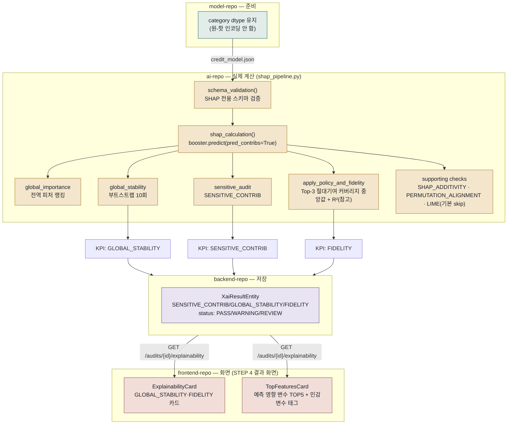

# 02. SHAP 사용 흐름 설명

> 4개 저장소를 관통하는 흐름입니다: `model-repo`(준비) → `ai-repo`(실제 계산) → `backend-repo`(저장) → `frontend-repo`(화면 표시).

 

## SHAP이 뭔가요?

모델이 "이 사람은 연체할 확률이 80%"라고 예측했다고 해봅시다.   SHAP은 그 80% 중에 소득이 몇 %p를 올렸고, 나이가 몇 %p를 내렸는지를 변수 하나하나 단위로 쪼개서 알려주는 도구입니다.   이 프로젝트는 SHAP 계산 자체를 XGBoost에 내장된 **TreeSHAP**(트리 모델 전용 정확한 계산법)으로 하기 때문에, 별도로 `shap` 파이썬 패키지를 설치해서 쓰지는 않습니다.

 

## 전체 흐름

  

## 1. model-repo — SHAP이 잘 나오도록 준비

SHAP은 변수 단위로 기여도를 설명합니다.   그런데 만약 `NAME_EDUCATION_TYPE`을 원-핫 인코딩해서 `NAME_EDUCATION_TYPE_대학원`, `_고등학교` … 이렇게 여러 컬럼으로 쪼개버리면 어떻게 될까요?   SHAP 설명도 쪼개진 컬럼마다 따로 나와버려서, "학력이 전체적으로 얼마나 영향을 줬는지" 한눈에 보기가 어려워집니다.   그래서 `model-repo`는 pandas의 `category` dtype과 XGBoost의 `enable_categorical=True`를 써서 원래 변수 하나를 그대로 유지합니다.   model-repo가 SHAP을 위해 하는 일은 사실 이게 전부입니다 — 실제 SHAP 계산 자체는 여기서 하지 않습니다.

 

## 2. ai-repo — 실제 SHAP 계산

**입구**:  
백엔드가 `POST /internal/v1/shap/analyze`를 호출하면서 `model_s3_key`, `audit_dataset_s3_key`, `target_column`, `sensitive_features`를 보냅니다. ai-repo는 이 키를 받아 S3에서 모델과 데이터를 내려받습니다.

 

**들어가기 전에 한 번 더 확인합니다**:  
본격적인 계산에 들어가기 전, `shap_pipeline.py`의 `schema_validation()`이 모델 피처 누락·필수 컬럼(`TARGET`/`SK_ID_CURR`) 누락·컬럼 중복만 가볍게 확인합니다.   이 검증은 03번 문서에서 다루는 Fairlearn 쪽 `validation.py`의 5단계 검증과는 완전히 별개의 함수입니다 — SHAP 경로는 `validation.py`를 아예 부르지 않습니다.   왜 두 경로가 서로 다른 검증기를 쓰는지는 01번 문서 5절에 정리해 뒀습니다.   여기서 걸리면 `ValueError`가 올라가 422로 응답합니다.

 

**계산은 이렇게 진행됩니다 (`shap_calculation()`)**:  
1. 감사 데이터에서 최대 5,000행을 샘플링합니다.
2. `booster.predict(dm, pred_contribs=True)` — 이 한 줄이 사실상 TreeSHAP 계산의 전부입니다. 각 행·각 피처별 기여도(`shap_values`)와 기준값(`base_values`)을 돌려줍니다.
3. `base_values + shap_values의 합`이 실제 예측값과 오차 0.0001 이내로 맞는지 검증합니다. SHAP 계산이 수학적으로 제대로 됐는지 스스로 점검하는 단계인데, 이 결과는 `SHAP_ADDITIVITY`라는 이름으로 report에 남을 뿐 백엔드에 저장되는 핵심 지표에는 포함되지 않습니다.

 

**백엔드로 넘어가 실제로 저장되는 지표는 세 가지입니다.** 

| 지표 코드 | 계산 방법 | 의미 |
|---|---|---|
| `SENSITIVE_CONTRIB` | `Σ｜민감변수 SHAP｜ / Σ｜전체 SHAP｜` | 민감변수(성별·나이)가 예측에 직접 얼마나 영향을 줬는지 비율. 0.20을 넘으면 주의, 0.30을 넘으면 추가검토 대상입니다. |
| `GLOBAL_STABILITY` | 감사 데이터를 10번 다르게 뽑아(부트스트랩) 전역 피처 랭킹이 얼마나 안정적인지, Spearman 상관계수의 평균으로 측정 | 랭킹이 매번 크게 바뀐다면 그 설명을 믿기 어렵겠죠. 0.70 이상이면 PASS, 0.50~0.70이면 WARNING, 0.50 미만이면 REVIEW로 분류됩니다. |
| `FIDELITY` | 공개해도 되는 top-3 근거만 남겼을 때, 그 top-3의 절대 SHAP값 합이 전체 절대 SHAP값 합에서 차지하는 비율(`absolute_contribution_coverage`)의 중앙값 | "이 세 가지가 이유입니다"라는 요약이 실제 설명 전체에서 얼마나 큰 비중을 차지하는지 보여줍니다. 0.50 이상이면 PASS, 0.30~0.50이면 WARNING, 0.30 미만이면 REVIEW입니다. |

 

FIDELITY와 관련해서 하나 짚고 넘어갈 부분이 있는데요,  
"top-3만으로 실제 예측을 얼마나 재현하는지"를 나타내는 R²(`margin_reconstruction_r2`)라는 값도 함께 계산되긴 하지만, 이건 report에만 참고용으로 남는 부가 지표일 뿐 FIDELITY 값 자체는 아닙니다.   FIDELITY의 실체는 어디까지나 "top-3가 전체 기여도 중 얼마를 차지하느냐"는 커버리지 비율입니다.

> 코드에 명시된 한계도 하나 알아두면 좋습니다. `SENSITIVE_CONTRIB`은 "모델 입력으로 직접 쓰인 민감변수 계열의 직접 기여도만 측정하며, 프록시 효과(예: 특정 우편번호가 사실상 인종을 대신하는 경우)는 측정하지 않는다"고 코드 주석에 명시돼 있습니다. 완전한 공정성 보장이 아니라 하나의 보조 신호로 봐야 합니다.

 

이 세 지표 말고도 파이프라인은 `SHAP_ADDITIVITY`(계산 정합성 자체 점검), `PERMUTATION_ALIGNMENT`(SHAP 랭킹과 순열 중요도 랭킹이 얼마나 일치하는지), 그리고 LIME 정합성 검사(기본값 `skip_lime=True`라 평소엔 건너뜁니다)까지 더 계산합니다.   다만 이 셋은 `include_report=True`로 요청했을 때만 채워지는 report에만 남는 보조 점검이고, 감사의 최종 상태(PASS/WARNING/REVIEW)는 오직 위 세 핵심 지표만으로 결정됩니다.

 

## 3. backend-repo — 결과 저장

ai-repo 응답(`pipeline_status`, `key_metrics{...}`)을 받으면, 먼저 `pipeline_status`가 `COMPLETED`인지 확인한 뒤 세 지표를 각각 `XaiResultEntity` 행으로 저장합니다(`(audit_id, metric_code)` 유니크 제약이 걸려 있습니다).   상태(`XaiStatus`)는 `PASS`/`WARNING`/`REVIEW` 3단계인데, 이건 ai-repo가 계산에 쓰는 `status_min`/`status_max` 판정(`PASS`/`WARNING`/`REVIEW`/`NOT_EVALUATED`)을 그대로 이어받은 것입니다.   `FAIL`이라는 등급은 없습니다.

`include_report=true`로 요청했을 때는 `global_importance_top`(전역 피처 랭킹 상위 N개)도 함께 받아 `ShapFeatureImportanceEntity`로 저장해 두는데, 이게 바로 프론트의 "예측 영향 변수 TOP5" 카드가 쓰는 데이터입니다. 이 저장이 끝나면 감사는 다음 단계로 넘어가고, 이어서 FairLearn 계산이 시작됩니다.

 

## 4. frontend-repo — 화면 표시

SHAP 결과는 감사를 실행하는 화면(`AuditExecutionSection.tsx`)이 아니라, 감사가 다 끝난 뒤 보여주는 결과 화면 `AuditResultsSection.tsx`(STEP 4)에 나타납니다.   이름 때문에 헷갈릴 수 있는데, `AuditExecutionSection.tsx`는 STEP 2로 모델·감사 데이터 파일을 업로드하고 민감변수를 지정하는 입력 화면일 뿐 결과를 보여주는 곳이 아닙니다.

`AuditResultsSection.tsx`가 `GET /audits/{auditId}/explainability` 결과를 받아오면, 이걸 두 카드에 나눠서 보여줍니다.

- **`ExplainabilityCard.tsx`("SHAP 설명가능성")** — `GLOBAL_STABILITY`(화면에는 "설명 일관성"으로 표시)와 `FIDELITY`(화면에는 "설명 충실성")만 카드로 보여줍니다. `SENSITIVE_CONTRIB`은 이 카드에서 의도적으로 빠져 있습니다.
- **`TopFeaturesCard.tsx`("예측 영향 변수 TOP5")** — `global_importance_top`을 기준으로 상위 5개 피처를 막대그래프로 보여주고, 민감변수 계열에 속한 피처에는 "민감변수" 태그를 붙입니다. `SENSITIVE_CONTRIB`이 원래 다루던 정보, 즉 "민감변수가 얼마나 영향을 줬는가"는 이 카드의 태그를 통해 간접적으로 확인하게 되는 셈입니다.

두 카드 모두 상태를 PASS/WARNING/REVIEW라는 원문 그대로 노출하지 않고, "충족/주의/추가검토" 세 단계 한글 배지로 바꿔서 보여줍니다.

 

## 입력 / 출력 한눈에 보기

| 단계 | 입력 | 출력 |
|---|---|---|
| model-repo | `application_train.csv` | `credit_model.json`(category dtype 유지) |
| ai-repo | `model_s3_key`, `audit_dataset_s3_key`, `sensitive_features` | `SENSITIVE_CONTRIB`/`GLOBAL_STABILITY`/`FIDELITY` + PASS/WARNING/REVIEW (부가로 `global_importance_top`, supporting checks가 담긴 report) |
| backend-repo | ai-repo 응답 | `XaiResultEntity` 3행 + `ShapFeatureImportanceEntity`(선택) |
| frontend-repo | `GET /audits/{id}/explainability` | `ExplainabilityCard`(지표 카드 2개) + `TopFeaturesCard`(TOP5 피처) |

 

## 용어 쉽게 정리

- **TreeSHAP**: 트리 기반 모델에서 각 예측에 대해 "이 변수가 없었다면 결과가 어떻게 바뀌었을까"를 정확하게 계산하는 알고리즘입니다.
- **부트스트랩(Bootstrap)**: 같은 데이터에서 무작위로 다시 뽑기를 반복해 "결과가 얼마나 안정적인지"를 테스트하는 방법입니다.
- **절대 SHAP값 커버리지(absolute contribution coverage)**: 선택한 top-K 피처의 절대 SHAP값 합이, 전체 피처 절대 SHAP값 합 중 몇 %를 차지하는지를 나타냅니다. FIDELITY 지표가 실제로 쓰는 값이 바로 이 커버리지의 중앙값입니다.
- **R² (결정계수)**: 예측값이 실제값을 얼마나 잘 설명하는지 나타내며, 1에 가까울수록 잘 설명한다는 뜻입니다. 다만 FIDELITY 지표 값 자체는 아니고, report에 남는 참고 수치일 뿐입니다.
