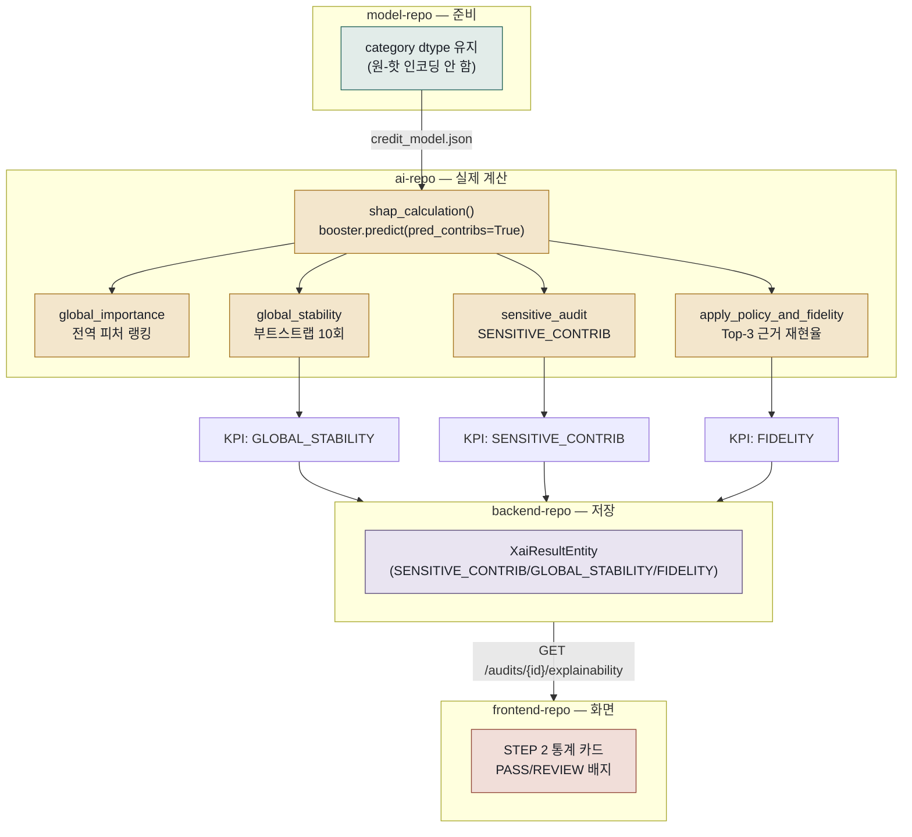

# 02. SHAP 사용 흐름 설명

> 4개 저장소를 관통하는 흐름입니다: `model-repo`(준비) → `ai-repo`(실제 계산) → `backend-repo`(저장) → `frontend-repo`(화면 표시).

## SHAP이 뭔가요? (쉽게 말하면)

모델이 "이 사람은 연체할 확률이 80%"라고 예측했을 때, SHAP은 **"그 80% 중에 소득이 몇 %p를 올렸고, 나이가 몇 %p를 내렸는지"**를 변수 하나하나 단위로 쪼개서 알려줍니다. 이 프로젝트는 SHAP 계산 자체를 XGBoost에 내장된 **TreeSHAP**(트리 모델 전용 정확한 계산법)으로 하기 때문에, 별도의 `shap` 파이썬 패키지는 쓰지 않습니다.

---

## 전체 흐름

---

## 1. model-repo — SHAP이 잘 나오도록 준비

SHAP은 변수 단위로 기여도를 설명합니다. 만약 `NAME_EDUCATION_TYPE`을 원-핫 인코딩해서 `NAME_EDUCATION_TYPE_대학원`, `_고등학교` … 여러 컬럼으로 쪼개면, SHAP 설명도 쪼개진 컬럼마다 따로 나와서 "학력이 전체적으로 얼마나 영향을 줬는지" 한눈에 보기 어려워집니다. 그래서 `model-repo`는 pandas `category` dtype + XGBoost `enable_categorical=True`를 써서 **원래 변수 하나를 그대로 유지**합니다. model-repo가 SHAP을 위해 하는 일은 정확히 여기까지이고, 실제 SHAP 계산은 하지 않습니다.

## 2. ai-repo — 실제 SHAP 계산

**입구**: 백엔드가 `POST /internal/v1/shap/analyze`를 호출하면서 `model_s3_key`, `audit_dataset_s3_key`, `target_column`, `sensitive_features`를 보냅니다. ai-repo는 이 키로 S3에서 모델·데이터를 내려받습니다.

**계산 (`shap_calculation()`)**:
1. 감사 데이터에서 최대 5,000행을 샘플링
2. `booster.predict(dm, pred_contribs=True)` — 이 한 줄이 TreeSHAP 계산입니다. 각 행·각 피처별 기여도(`shap_values`)와 기준값(`base_values`)을 돌려줍니다
3. 검증: `base_values + shap_values의 합 ≈ 실제 예측값`이 오차 0.0001 이내인지 확인 (SHAP 계산이 수학적으로 맞는지 자체 점검)

**이 결과로 만드는 3대 지표**:

| 지표 코드 | 계산 방법 | 의미 |
|---|---|---|
| `SENSITIVE_CONTRIB` | `Σ｜민감변수 SHAP｜ / Σ｜전체 SHAP｜` | 민감변수(성별·나이)가 예측에 직접 얼마나 영향을 줬는지 비율. **0.20 초과면 경고** |
| `GLOBAL_STABILITY` | 감사 데이터를 10번 다르게 뽑아(부트스트랩) 전역 피처 랭킹이 얼마나 안정적인지 | 랭킹이 매번 크게 바뀌면 설명을 믿기 어려움 |
| `FIDELITY` | 공개 가능한 top-3 근거만으로 실제 예측을 얼마나 재현하는지(R²) | "이 3가지가 이유입니다"라는 요약이 실제로 얼마나 정확한지 |

> 코드에 명시된 한계: `SENSITIVE_CONTRIB`은 "모델 입력으로 직접 쓰인 민감변수 계열의 직접 기여도만 측정하며, 프록시 효과(예: 특정 우편번호가 사실상 인종을 대신하는 경우)는 측정하지 않는다." 완전한 공정성 보장이 아니라 하나의 보조 신호입니다.

## 3. backend-repo — 결과 저장

ai-repo 응답(`pipeline_status`, `overall_status`, `key_metrics{...}`)을 받으면, `pipeline_status`가 `COMPLETED`인지 먼저 확인하고, 3개 지표를 각각 `XaiResultEntity` 행으로 저장합니다(`(audit_id, metric_code)` 유니크). 상태는 `PASS` 또는 `REVIEW`(FAIL 없음)로만 분류됩니다. 이 저장이 끝나면 감사 진행 단계가 "SHAP 완료"로 넘어가고, 곧이어 FairLearn 계산이 시작됩니다.

## 4. frontend-repo — 화면 표시

`AuditExecutionSection.tsx`의 STEP 2 영역이 `GET /audits/{auditId}/explainability` 결과를 받아, `SENSITIVE_CONTRIB`/`GLOBAL_STABILITY`/`FIDELITY` 3개를 한국어 라벨("민감변수 기여비율" 등)과 함께 통계 카드로 보여주고, 값이 임계값을 넘으면 REVIEW 배지를 붙입니다. 이 화면이 이 지표들의 유일한 표시 위치입니다.

---

## 입력 / 출력 한눈에 보기

| 단계 | 입력 | 출력 |
|---|---|---|
| model-repo | `application_train.csv` | `credit_model.json`(category dtype 유지) |
| ai-repo | `model_s3_key`, `audit_dataset_s3_key`, `sensitive_features` | `SENSITIVE_CONTRIB`/`GLOBAL_STABILITY`/`FIDELITY` + PASS/WARNING |
| backend-repo | ai-repo 응답 | `XaiResultEntity` 3행 (DB 저장) |
| frontend-repo | `GET /audits/{id}/explainability` | 통계 카드 UI |

## 용어 쉽게 정리

- **TreeSHAP**: 트리 기반 모델에서 각 예측에 대해 "이 변수가 없었다면 결과가 어떻게 바뀌었을까"를 정확하게 계산하는 알고리즘.
- **부트스트랩(Bootstrap)**: 같은 데이터에서 무작위로 다시 뽑기를 반복해 "결과가 얼마나 안정적인지"를 테스트하는 방법.
- **R² (결정계수)**: 예측값이 실제값을 얼마나 잘 설명하는지, 1에 가까울수록 잘 설명함.
