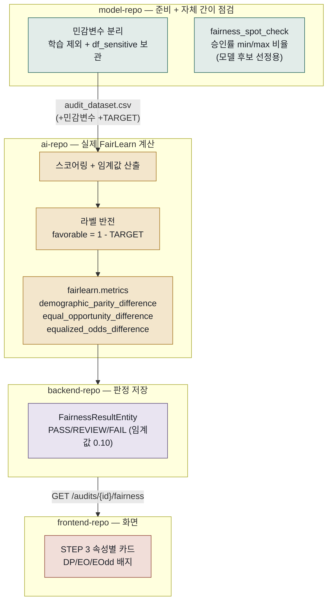

# 03. FairLearn 사용 흐름 설명

> 4개 저장소를 관통하는 흐름입니다: `model-repo`(민감변수 분리 + 자체 간이 점검) → `ai-repo`(실제 FairLearn 계산) → `backend-repo`(판정 저장) → `frontend-repo`(화면 표시).

## FairLearn이 뭔가요? (쉽게 말하면)

"모델이 성별·나이와 무관하게 공평하게 승인/거절하고 있는가"를 수치로 측정하는 라이브러리입니다. 정확도가 높아도, 특정 그룹에 유독 불리하게 작동한다면 규제·윤리적으로 문제가 됩니다. 이 프로젝트에서 FairLearn 계산은 **오직 `ai-repo`에서만** 일어납니다 — `model-repo`는 자체 정의한 간이 지표만 씁니다.

---

## 전체 흐름

---

## 1. model-repo — 준비 + 자체 간이 점검 (진짜 FairLearn 아님)

`CODE_GENDER`, `DAYS_BIRTH`, `AGE`, `AGE_GROUP`을 학습 피처에서 완전히 빼고 `df_sensitive`라는 별도 테이블에 보관합니다. 이건 모델이 성별·나이를 직접 학습하는 "직접 차별"을 막기 위한 조치입니다.

모델 후보(Baseline vs Improved)를 고르는 동안, `fairness_spot_check()`라는 **자체 정의 함수**로 간이 점검을 합니다: 임계값 0.5로 승인/거절을 나눈 뒤, 성별·연령대 그룹별 승인률을 구해서 `(가장 낮은 그룹 승인률) / (가장 높은 그룹 승인률)`을 계산합니다. 1에 가까울수록 그룹 간 격차가 적다는 뜻입니다.

> **주의**: 이건 FairLearn 라이브러리가 아닙니다. model-repo가 "어느 모델 후보를 고를지" 참고하기 위해 직접 만든 간단한 비율 계산이고, 진짜 공정성 감사에 쓰이는 표준 지표(demographic parity difference 등)와는 계산 방식이 다릅니다.

## 2. ai-repo — 실제 FairLearn 계산

**입구**: 백엔드가 `POST /internal/v1/fairness/analyze`를 호출하면서 `model_s3_key`, `audit_dataset_s3_key`, (있다면) `validation_dataset_s3_key`, `sensitive_features`, 임계값 정보를 보냅니다.

**계산 순서 (`run_audit()`)**:

1. **입력 검증** — 민감변수 그룹이 각각 최소 300건은 있는지 확인 (`MIN_GROUP_SIZE=300`). 부족하면 `INSUFFICIENT_DATA`.
2. **스코어링 + 임계값** — 모델로 위험도 점수를 계산하고, 목표 승인율(또는 수동 지정값)에 맞는 임계값을 정해서 승인/거절을 가릅니다.
3. **라벨 반전** — `TARGET=1`은 "연체"를 뜻하는데, FairLearn은 라벨 1을 "좋은 결과"로 취급합니다. 그래서 `favorable_label = 1 - TARGET`(우량고객=1), `favorable_pred = 승인여부`로 뒤집어서 넣습니다. 이 반전을 안 하면 지표가 정반대로 나옵니다.
4. **FairLearn 3종 계산**:

| 지표 | 라이브러리 함수 | 의미 (쉽게) |
|---|---|---|
| Demographic Parity | `demographic_parity_difference` | 그룹 간 **승인률** 격차가 얼마나 되는가 |
| Equal Opportunity | `equal_opportunity_difference` | **우량고객(진짜 정상상환자)** 중에서 그룹 간 승인률 격차가 얼마나 되는가 |
| Equalized Odds | `equalized_odds_difference` | 오탐률·오거부율 격차 중 더 큰 쪽 |

이 세 함수는 `fairlearn.metrics`에서 직접 불러옵니다(`MetricFrame`은 쓰지 않고 세 함수만 개별 호출). 민감변수(성별·연령대 등)마다 각각 계산해서 속성별로 결과를 냅니다.

## 3. backend-repo — 판정 저장

ai-repo가 돌려준 `fairness_by_attribute`(속성별 상세)를 받아 각 지표값과 **백엔드가 자체 정의한 임계값(0.10, REVIEW는 그 2배)**으로 비교해 PASS/REVIEW/FAIL을 매깁니다. `FairnessResultEntity`에 `(audit_id, metric_code, attribute)` 단위로 저장합니다. 하나라도 FAIL이면 감사 전체가 `NON_COMPLIANT`, FAIL 없이 REVIEW가 있으면 `WARNING`, 전부 PASS면 `COMPLIANT`로 최종 판정됩니다.

> 참고: 이 PASS/REVIEW/FAIL 임계값은 코드에 `TODO: 정책값 미확정`으로 표시돼 있어, 아직 최종 확정된 값은 아닙니다.

## 4. frontend-repo — 화면 표시

`AuditExecutionSection.tsx`의 STEP 3 영역이 `GET /audits/{auditId}/fairness` 결과를 속성별(예: `CODE_GENDER`, `AGE_GROUP`)로 그룹지어, DP/EO/EOdd 값을 PASS/REVIEW/FAIL 배지로 보여줍니다.

---

## 입력 / 출력 한눈에 보기

| 단계 | 입력 | 출력 |
|---|---|---|
| model-repo | `application_train.csv` | `df_sensitive`(민감변수 별도 보관), 간이 공정성 비율(모델 선정용) |
| ai-repo | `audit_dataset.csv`(+민감변수), 임계값 설정 | 속성별 DP/EO/EOdd 값 |
| backend-repo | ai-repo 응답 | `FairnessResultEntity` (PASS/REVIEW/FAIL) |
| frontend-repo | `GET /audits/{id}/fairness` | 속성별 카드 UI |

## 용어 쉽게 정리

- **Demographic Parity(인구통계학적 균등)**: "성별과 무관하게 승인율이 같아야 한다"는 가장 단순한 공정성 정의. 다만 실제로 두 그룹의 신용도 분포가 다르면 이 지표만으로는 부족할 수 있습니다.
- **Equal Opportunity(기회의 균등)**: "실제로 갚을 사람들" 안에서만 놓고 봤을 때 승인율이 같은가를 봅니다. Demographic Parity보다 더 정교한 기준입니다.
- **라벨 반전이 필요한 이유**: 지표를 계산하는 라이브러리는 보통 "1 = 좋은 결과"를 기준으로 만들어져 있는데, 이 프로젝트의 `TARGET=1`은 "나쁜 결과(연체)"이기 때문에 그대로 넣으면 지표 해석이 뒤집힙니다.

---

## 세 문서를 통틀어 가장 중요한 발견

`model-repo`가 만드는 `valid_processed.csv`(별도 Validation 데이터셋)는 ai-repo의 임계값 캘리브레이션에 쓰일 수 있게 설계돼 있지만, **현재 frontend에 이 데이터셋을 업로드하는 UI가 없어서 실제로는 한 번도 쓰이지 않습니다.** 4개 저장소 중 유일하게 "만들어놨지만 연결이 끊긴" 지점입니다.
