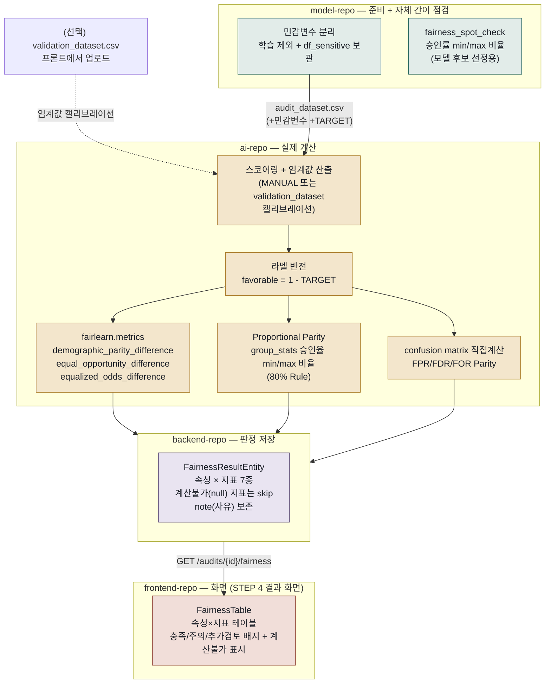

# 03. FairLearn 사용 흐름 설명

> 4개 저장소를 관통하는 흐름입니다: `model-repo`(민감변수 분리 + 자체 간이 점검) → `ai-repo`(실제 FairLearn/직접계산) → `backend-repo`(판정 저장) → `frontend-repo`(화면 표시).

 

## FairLearn이 뭔가요? (쉽게 말하면)

모델이 성별·나이와 무관하게 공평하게 승인/거절하고 있는지를 수치로 측정하는 라이브러리입니다.  정확도가 아무리 높아도 특정 그룹에 유독 불리하게 작동한다면 규제·윤리적으로 문제가 되니까요.  이 프로젝트에서 FairLearn 계산은 오직 `ai-repo`에서만 일어나고, `model-repo`는 자체적으로 정의한 간이 지표만 씁니다.

"금융분야 인공지능 가이드라인"(p.44)이 제시하는 공정성 지표 선택 트리는 6가지 지표(①Equal Parity ②Proportional Parity ③FDR Parity ④FPR Parity ⑤FOR Parity ⑥FNR Parity) 중 상황에 맞는 걸 하나 고르도록 안내합니다.  그런데 이 프로젝트는 감사 도구라는 성격 때문에 "어떤 게 맞는지 하나만 골라주는" 대신, 6개를 전부 계산해서 감사자에게 보여주고 판단은 사람이 하도록 설계했습니다.

  

## 전체 흐름

  

## 1. model-repo — 준비 + 자체 간이 점검 (진짜 FairLearn은 아닙니다)

`CODE_GENDER`, `DAYS_BIRTH`, `AGE`, `AGE_GROUP`을 학습 피처에서 완전히 빼고 `df_sensitive`라는 별도 테이블에 보관해 둡니다.  모델이 성별·나이를 직접 학습해버리는 "직접 차별"을 막기 위한 조치입니다. 

모델 후보(Baseline vs Improved)를 고르는 동안에는 `fairness_spot_check()`라는 자체 정의 함수로 간단히 점검합니다.  임계값 0.5로 승인/거절을 나눈 뒤 성별·연령대 그룹별 승인률을 구해서, `(가장 낮은 그룹 승인률) / (가장 높은 그룹 승인률)`을 계산하는 방식입니다.  1에 가까울수록 그룹 간 격차가 적다는 뜻이죠.

> 여기서 주의할 점이 하나 있습니다. 이건 FairLearn 라이브러리가 아닙니다. model-repo가 "어느 모델 후보를 고를지" 참고하려고 직접 만든 간단한 비율 계산일 뿐이고, 진짜 공정성 감사에 쓰이는 표준 지표(demographic parity difference 등)와는 계산 방식 자체가 다릅니다. 다만 방식(그룹별 비율의 min/max)만 놓고 보면 아래 2절의 Proportional Parity와 개념적으로 같은 아이디어입니다. model-repo가 모델 선정용으로 쓰던 간이 로직이, 이제 ai-repo에서는 정식 감사 지표(80% Rule)로도 쓰이는 셈이죠.

 

## 2. ai-repo — 실제 계산 (FairLearn 3종 + 직접계산 3종 + 비율 1종 = 6종)

**입구**:  
백엔드가 `POST /internal/v1/fairness/analyze`를 호출하면서 `model_s3_key`, `audit_dataset_s3_key`, (있다면) `validation_dataset_s3_key`, `sensitive_features`, 임계값 정보를 함께 보냅니다.

 

**계산 순서 (`run_audit()` → `compute_attribute_fairness()`)** 는 이렇게 진행됩니다.

1. **입력 검증** — `validate_audit_inputs()`가 민감변수 그룹이 각각 최소 300건은 되는지 확인합니다(`MIN_GROUP_SIZE=300`, 부족하면 WARN). 비교 가능한 집단이 2개 미만이면 이때는 BLOCK으로 감사 자체를 막습니다. 이 검증은 SHAP 경로가 쓰는 스키마 검증과는 다른 함수인데, 자세한 차이는 01번 문서 5절을 참고하세요.
2. **스코어링 + 임계값 산출** — 모델로 위험도 점수를 계산하고, 목표 승인율(또는 수동 지정값, 또는 업로드된 validation 데이터셋 기준)에 맞춰 임계값을 정해서 승인/거절을 가릅니다.
3. **라벨 반전** — `TARGET=1`은 "연체"를 뜻하는데, FairLearn은 라벨 1을 "좋은 결과"로 취급합니다. 그래서 `favorable_label = 1 - TARGET`(우량고객=1), `favorable_pred = 승인여부`로 뒤집어서 넣습니다. 이 반전을 빠뜨리면 지표가 정반대로 나와버립니다.
4. **지표 계산** — 아래 6종을 한 번에 계산합니다.

 

| 가이드라인 선택 트리 | 지표 코드 | 계산 방법 | 의미 (쉽게) |
|---|---|---|---|
| ① Equal Parity | `DEMOGRAPHIC_PARITY` | `fairlearn.metrics.demographic_parity_difference` | 그룹 간 승인률 격차가 얼마나 되는가 |
| ② Proportional Parity | `PROPORTIONAL_PARITY` | `min(그룹별 승인율) / max(그룹별 승인율)` — FairLearn에 없는 지표라 직접 계산 | 승인율이 "비율"로 얼마나 비슷한가. 0.8 이상이면 80% Rule 충족(다른 지표와 달리 1에 가까울수록 공정) |
| ③ FDR Parity | `FDR_PARITY` | confusion matrix `FP/(FP+TP)` 그룹별 격차 — 예측 조건부라 FairLearn에 없음, 직접 계산 | 승인된 고객 중 실제로는 연체였던(오승인) 비율 격차 |
| ④ FPR Parity | `FPR_PARITY` | confusion matrix `FP/(FP+TN)` 그룹별 격차 — 직접 계산 | 실제 연체 고객 중 오승인된 비율 격차 |
| ⑤ FOR Parity | `FOR_PARITY` | confusion matrix `FN/(FN+TN)` 그룹별 격차 — 직접 계산 | 거절된 고객 중 실제로는 정상이었던(오거절) 비율 격차 |
| ⑥ FNR Parity | `EQUAL_OPPORTUNITY`(equal_opportunity_difference) | `fairlearn.metrics.equal_opportunity_difference` | 수학적으로 FNR Parity와 동치입니다(TPR=1-FNR이므로). 그래서 별도로 구현하지 않고 기존 Equal Opportunity 값을 그대로 씁니다. |

 

여기에 `EQUALIZED_ODDS`(`equalized_odds_difference` — TPR 격차와 FPR 격차 중 더 큰 값)도 참고 지표로 함께 계산합니다. 가이드라인이 요구하는 6종에는 포함되지 않지만, "정상 고객 오거절률"과 "연체 고객 오승인률" 중 더 나쁜 쪽을 한눈에 보여주는 보조 지표라 계속 남겨두고 있습니다.

 

**계산이 안 될 때도 있습니다.**  한 집단이라도 특정 조건의 표본이 아예 없으면(예: 그 나이대에 연체 고객이 한 명도 없는 경우) 그 지표는 `None`으로 돌아오고, `note` 필드에 "일부 집단에 정상 또는 연체 고객이 없어 해당 지표를 계산할 수 없음"이라는 사유가 함께 담깁니다.

> 코드 근거를 남기자면, `app/services/fairness/fairness.py`의 `_confusion_counts`/`_safe_rate`/`_max_min_gap`가 ③④⑤를, `compute_attribute_fairness()`가 ②를 계산합니다.

  

## 3. backend-repo — 판정 저장

ai-repo가 돌려준 `fairness_by_attribute`(속성별 상세)를 받아서 `FairnessResultEntity`에 `(audit_id, metric_code, attribute)` 단위로 저장합니다.  속성 하나당 최대 7개 지표 행이 생기는 셈입니다.

판정 로직은 두 가지로 나뉩니다(`FairnessResultService.java`의 `judgeStatus`/`judgeRatioStatus`, 코드 상수로 고정돼 있습니다).

- **Demographic/Equal Opportunity/Equalized Odds/FPR/FDR/FOR** — 격차형 지표라 값이 작을수록 공정합니다. 임계값 0.20 이하면 PASS, 0.20을 넘고 0.40 이하면 REVIEW, 0.40을 넘으면 FAIL입니다. REVIEW 상한은 임계값의 2배(`REVIEW_THRESHOLD_MULTIPLIER=2`)로 정해져 있습니다. 이 0.20이라는 숫자는 "금융분야 인공지능 가이드라인"의 80% Rule(1 − 0.80 = 0.20)을 격차 지표에 근사한 값이라는 설명이 코드 주석에 남아 있습니다.
- **Proportional Parity** — 비율형 지표라 값이 클수록 공정합니다. 0.80 이상이면 PASS, 0.70 이상 0.80 미만이면 REVIEW, 0.70 미만이면 FAIL입니다.

 

**계산 자체가 안 된(null) 지표는 어떻게 될까요?**  ai-repo가 특정 지표를 `None`으로 내려주면(표본 부족 등으로 정의 자체가 불가능한 경우), 그 지표 행만 저장하지 않고 조용히 건너뜁니다.  예전에는 지표 하나만 null이어도 감사 전체가 `AuditFailedException`으로 실패해버렸는데, 지금은 계산 가능한 지표만 정상 저장하고 계산 불가 사유(`note`)를 함께 남기는 방식으로 바뀌었습니다.

지표 중 하나라도 FAIL이 있으면 감사 전체가 `NON_COMPLIANT`, FAIL은 없는데 REVIEW가 있으면 `WARNING`, 전부 PASS면 `COMPLIANT`로 최종 판정됩니다.

  

## 4. frontend-repo — 화면 표시

Fairlearn 결과도 SHAP과 마찬가지로 감사를 실행하는 화면(`AuditExecutionSection.tsx`, STEP 2 — 모델·데이터 업로드용)이 아니라, 감사가 끝난 뒤 보여주는 결과 화면 `AuditResultsSection.tsx`(STEP 4)의 `FairnessTable.tsx`에서 표시됩니다.

`FairnessTable.tsx`는 `GET /audits/{auditId}/fairness` 결과를 받아서 속성별(`CODE_GENDER`, `AGE_GROUP`)로 행을 나누고, 7개 지표를 열로 나눈 표를 그립니다. 각 셀에는 값과 함께 PASS/REVIEW/FAIL 원문 대신 "충족/주의/추가검토" 세 단계 한글 배지가 붙고, 해당 속성·지표 조합의 결과가 아예 없으면(계산 불가) "—"와 "계산불가" 배지, "표본 부족"이라는 안내 문구가 대신 표시됩니다.  열 헤더를 클릭하면 그 지표의 설명과 판정 기준을 담은 팝오버가 뜹니다.

  

## 입력 / 출력 한눈에 보기

| 단계 | 입력 | 출력 |
|---|---|---|
| model-repo | `application_train.csv` | `df_sensitive`(민감변수 별도 보관), 간이 공정성 비율(모델 선정용) |
| ai-repo | `audit_dataset.csv`(+민감변수), (선택) `validation_dataset.csv`, 임계값 설정 | 속성별 6개 공정성 지표 값(+ Equalized Odds 참고 지표) |
| backend-repo | ai-repo 응답 | `FairnessResultEntity` — 속성×지표 최대 7행 (PASS/REVIEW/FAIL, 계산불가 지표는 미저장) |
| frontend-repo | `GET /audits/{id}/fairness` | `FairnessTable`(속성×지표 테이블, 충족/주의/추가검토 배지 + 계산불가 사유) |

  

## 용어 쉽게 정리

- **Demographic Parity(인구통계학적 균등)**: "성별과 무관하게 승인율이 같아야 한다"는 가장 단순한 공정성 정의입니다. 다만 실제로 두 그룹의 신용도 분포가 다르다면 이 지표만으로는 부족할 수 있습니다.
- **Equal Opportunity(기회의 균등)**: "실제로 갚을 사람들" 안에서만 놓고 봤을 때 승인율이 그룹마다 같은지를 봅니다. Demographic Parity보다 더 정교한 기준이고, FNR(위음성률) Parity와 수학적으로 동일합니다.
- **Proportional Parity(비례성 패리티, 80% Rule)**: 그룹별 승인율의 비율(min/max)이 0.8 이상이어야 한다는 미국 EEOC의 오래된 실무 기준입니다. 다른 지표와 달리 "격차"가 아니라 "비율"이라 1에 가까울수록 공정합니다.
- **FDR(False Discovery Rate, 거짓 발견율)**: 승인된 사람들 중 실제로는 연체할 사람의 비율입니다. 이게 그룹마다 다르다면 "승인 품질"이 그룹마다 다르다는 뜻이겠죠.
- **FPR(False Positive Rate, 거짓 양성률)**: 실제 연체할 사람들 중 잘못 승인된 비율입니다.
- **FOR(False Omission Rate, 거짓 누락률)**: 거절된 사람들 중 실제로는 정상 상환할 사람의 비율입니다. 이게 그룹마다 다르다면 억울하게 거절당하는 비율이 그룹마다 다르다는 뜻입니다.
- **라벨 반전이 필요한 이유**: 공정성 지표를 계산하는 라이브러리는 보통 "1 = 좋은 결과"를 기준으로 만들어져 있는데, 이 프로젝트의 `TARGET=1`은 "나쁜 결과(연체)"입니다. 그대로 넣으면 지표 해석이 통째로 뒤집혀버리기 때문에 반전이 꼭 필요합니다.
