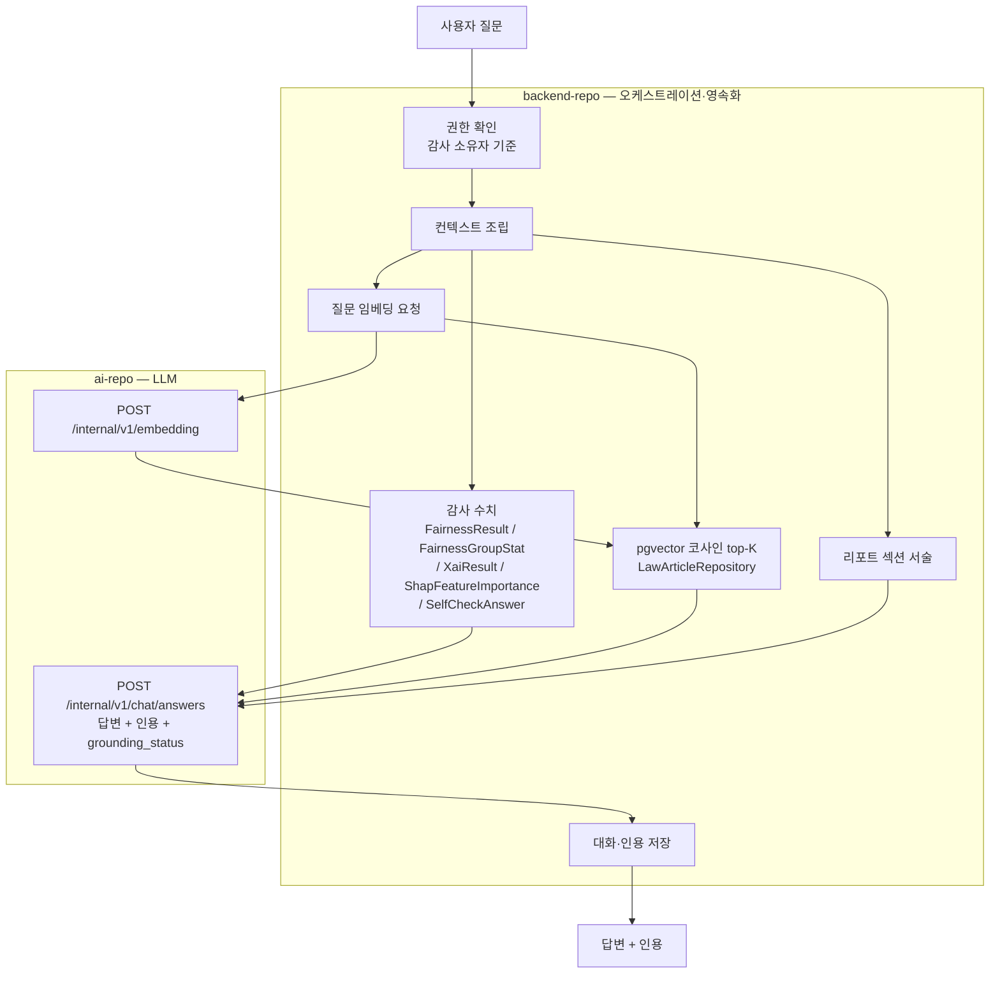

# 04. 감사 질의 챗봇 기획

> 2개 저장소가 관여합니다: `backend-repo`(권한·근거 조립·대화 저장) → `ai-repo`(답변 생성). 구현 이슈는 이 문서를 기준으로 삼고, 원칙이 바뀌면 이 문서를 먼저 고칩니다.

## 왜 필요한가요?

리포트는 **미리 정해진 목차로 한 번에 다 쓰는 산출물**입니다. 읽는 사람이 개별적으로 궁금해하는 것에는 답하지 못합니다.

- 컴플라이언스 담당자: "AGE_GROUP의 Equal Opportunity가 0.11인데, 어느 집단 때문인가요?"
- 심사역: "이 수치로 신용정보법 제36조의2 대응이 되나요?"
- 감사 준비: "작년 리포트엔 없던 FOR Parity가 왜 이번엔 N/A인가요?"

이미 계산·저장된 감사 결과와 법령을 근거로, 인용과 함께 답하는 것이 목표입니다. **새로 계산하지 않습니다.**

- **주 사용자**: 내부 실무자(컴플라이언스 담당자·심사역)
- **근거 범위**: 해당 감사 결과 + 법령 RAG + 생성된 리포트 서술

## 답하는 것 / 답하지 않는 것

경계를 먼저 못 박는 것이 이 기능의 핵심입니다.

| 구분 | 예시 질문 | 처리 |
| --- | --- | --- |
| 수치 조회·해석 | "여성 집단 승인율이 몇 %p 낮나요?" | 저장된 집단 통계로 답합니다 |
| 지표 의미 설명 | "Equalized Odds가 뭔가요?" | 정의 + 이번 감사 실제 값 |
| 법령 연결 | "이 편향 수준이 어느 조항과 관련 있나요?" | pgvector top-K 조항 인용 |
| 리포트 위치 안내 | "리포트 어디에 있는 내용인가요?" | 섹션 참조 |
| 판정 요구 | "그래서 이 모델이 공정한가요?" | **판정하지 않습니다.** 값·격차만 제시 |
| 재계산 요구 | "임계값을 0.5로 바꾸면 어떻게 되나요?" | 범위 밖. 별도 시뮬레이션 기능 |
| 개별 고객 건 | "이 고객이 왜 거절됐나요?" | 감사 데이터는 집단 통계라 근거가 없습니다 |

### 판정 금지는 일관성 문제입니다

편향진단서는 `ai-repo` #41에서 PASS/WARNING 판정을 **의도적으로 제외**하고 raw 값만 제시하도록 확정했습니다. 판정 임계값은 정책 영역이기 때문입니다. 챗봇이 대화라는 이유로 "공정합니다"라고 답해버리면 같은 플랫폼이 두 가지 입장을 내는 셈이 됩니다.

> 다만 `backend-repo`는 공정성 지표에 자체 임계값(difference 계열 0.20, 2배까지 REVIEW)을 적용해 `fairness_results.status`에 PASS/REVIEW/FAIL을 저장하고 있습니다. 챗봇이 이 **저장된 상태값을 인용하는 것**은 새 판정이 아니므로 허용합니다. 챗봇이 스스로 기준을 만들어 판단하는 것만 금지합니다.

## 전체 흐름



## 재사용하는 것 / 새로 만드는 것

신규 인프라가 거의 없습니다.

| 구성요소 | 상태 |
| --- | --- |
| pgvector 조항 검색 | ✅ 있음 — `LawArticleRepository`의 `embedding <=> CAST(:q AS vector)` top-K |
| 질문 임베딩 | ✅ 있음 — `ai-repo` `/internal/v1/embedding` + `FastApiEmbeddingClient` |
| LLM 호출 | ✅ 있음 — `app/services/llm.py`의 `complete()` |
| 감사 수치 저장소 | ✅ 있음 — 감사 결과 엔티티 6종 |
| **컨텍스트 조립기** | 🆕 신규 (backend) |
| **답변 엔드포인트·프롬프트** | 🆕 신규 (ai) |
| **대화 저장 스키마·API** | 🆕 신규 (backend) |

## 리포트 본문 참조 — 유일한 함정

세 근거 중 **리포트 본문만 비용이 다릅니다.** 리포트는 S3에 HTML/PDF/DOCX 파일로만 있고 본문 텍스트는 DB에 없습니다. 그대로 하면 매 질문마다 S3에서 150KB HTML을 받아 파싱해야 합니다.

**권장 대안**: `ai-repo`가 리포트를 생성할 때 이미 만드는 **섹션별 LLM 서술**을 응답에 함께 담아 백엔드가 저장합니다. 이미 메모리에 있는 값이라 추가 LLM 호출이 0입니다.

- 편향진단서: `overview_purpose` / `group_results` / `metric_results` / `tradeoff` / `overall_summary`
- 설명가능성·규제준수 판정서·개선 권고 가이드도 각각 섹션 서술을 가지고 있습니다
- 부수 효과: 리포트 파일을 내려받지 않고 웹에서 서술만 보여주는 것도 가능해집니다

## API 설계

```
POST   /api/v1/audits/{auditId}/conversations              대화 시작    201
GET    /api/v1/audits/{auditId}/conversations              대화 목록    200
POST   /api/v1/conversations/{conversationId}/messages     질문·답변    201
GET    /api/v1/conversations/{conversationId}/messages     대화 이력    200
DELETE /api/v1/conversations/{conversationId}              대화 삭제    204
```

AI 서버 내부: `POST /internal/v1/chat/answers`

**응답 형태** (`POST .../messages`)

```json
{
  "messageId": 42,
  "answer": "AGE_GROUP의 Equal Opportunity Difference는 0.1123입니다...",
  "citations": [
    { "type": "AUDIT_METRIC",   "reference": "EQUAL_OPPORTUNITY / AGE_GROUP", "value": "0.1123" },
    { "type": "GROUP_STAT",     "reference": "AGE_GROUP=20대 / approval_rate", "value": "0.7215" },
    { "type": "LAW_ARTICLE",    "reference": "신용정보법 제36조의2", "similarity": 0.83 },
    { "type": "REPORT_SECTION", "reference": "편향진단서 5장 공정성 지표 결과" }
  ],
  "groundingStatus": "GROUNDED"
}
```

`groundingStatus`는 `GROUNDED` / `PARTIAL` / `NOT_GROUNDED`(근거가 없어 답변 거부)입니다. 프론트가 이 값으로 경고 배지를 띄웁니다.

**타임아웃**: 리포트용 `reportRestClient`(600s)가 아니라 `shapRestClient`(120s)를 씁니다. 챗봇은 LLM 1회 호출이라 오래 걸리면 장애로 보는 것이 맞습니다.

## 데이터 모델

```
chat_conversations     (conversation_id, audit_id, user_id, title, created_at, updated_at)
chat_messages          (message_id, conversation_id, role, content, grounding_status, created_at)
chat_message_citations (citation_id, message_id, citation_type, reference, snippet,
                        similarity, source_url)
```

인용을 별도 테이블로 두는 이유는 **규제 대응 증적**입니다. "그때 그 답변의 근거가 무엇이었나"를 나중에 재구성할 수 있어야 하고, 법령이 개정되면(`law_revisions`) 과거 답변이 어떤 조항에 기반했는지 추적해야 합니다.

## 가드레일

| 위험 | 대응 |
| --- | --- |
| 환각 수치 | 주입된 값 외 수치 생성 금지. 답변의 모든 수치는 인용에 대응돼야 하며, 미대응 시 `PARTIAL` 표시 |
| 판정 유도 | 값·격차 제시 후 판정은 정책 영역임을 고지하도록 프롬프트에 고정 |
| 근거 없는 질문 | `NOT_GROUNDED`로 답변 거부. 지어내지 않습니다 |
| 권한 우회 | 감사 소유자 기준 조회만 허용 |
| 프롬프트 인젝션 | 사용자 질문·감사명을 시스템 지시와 분리된 블록에 배치 |
| 비용 폭주 | 사용자·감사별 일일 질문 수 제한(Redis) |
| 법령 최신성 | `law_revisions` 기준 개정 조항 인용 시 경고 표시 |
| 개인정보 유입 | 질문은 자유 입력이라 고객 식별정보가 들어올 수 있습니다. 입력 가이드 문구를 노출합니다 |

## 기본 결정 3건

구현을 막지 않는 기본값입니다. 팀에서 뒤집고 싶으면 이 문서를 고칩니다.

### 대화 보존 기간 — 감사에 종속

감사가 삭제되면 대화도 함께 삭제되도록 FK를 구성하고, 별도 보존 정책을 만들지 않습니다.

`AuditEntity.retention_until` 컬럼은 현재 **선언만 있고 어디서도 값을 넣거나 읽지 않습니다.** 지금 대화에 별도 숫자를 정하면 감사 보존이 실제로 구현될 때 두 정책이 어긋납니다. 증적 가치가 있는 것은 인용이고, 그것은 별도 테이블로 분리합니다.

### 접근 권한 — 감사 소유자 기준

감사·리포트 엔드포인트가 모두 소유자 기준(`findByIdAndUser_Id...`)이고 `hasRole`은 게시판에만 쓰입니다. 챗봇도 같은 방식을 쓰면 역할 체계(현재 DB 제약은 `ADMIN`/`AUDITOR`/`USER`, 명세서는 4-role) 확정을 기다릴 필요가 없습니다.

역할 기반 확장(예: 본인이 만들지 않은 감사도 컴플라이언스 담당자가 조회)은 역할 체계가 확정된 뒤 별도로 얹습니다.

### 모델 선택 — 설정만 분리, 기본값은 동일

`generate_chat_completion(model=...)`이 이미 호출별 오버라이드를 지원하므로, `openai_chat_model` 설정을 추가하되 기본값을 `openai_model`과 같게 둡니다. 응답 지연을 측정한 뒤 필요할 때 `.env`만 바꿔 전환합니다.

참고 실측치: 편향 리포트 생성 전체가 47~55초였는데 그중 LLM은 **섹션 5회 호출**이고 나머지는 6.1만 행 공정성 분석 + figure + Chromium PDF 렌더입니다. 챗봇은 **LLM 1회**라 같은 모델로도 훨씬 빠를 가능성이 큽니다. 다만 이는 추론이므로 1단계에서 반드시 측정합니다.

## 단계

| 단계 | 내용 | 저장소 |
| --- | --- | --- |
| 1 | 답변 엔드포인트 (계약 확정) | ai |
| 2 | 대화 스키마·API (감사 수치 그라운딩) | backend |
| 3 | 법령 RAG 인용 결합 | backend |
| 4 | 리포트 섹션 서술 반환 | ai |
| 5 | 리포트 서술 저장·참조 | backend |

멀티턴 대화 이력과 SSE 스트리밍은 1~3단계 결과를 보고 정합니다. 스펙이 확정되지 않은 채 방치되는 이슈를 만들지 않기 위해 지금은 등록하지 않습니다.

1단계만으로도 "리포트에 없는 각도의 질문"의 상당수가 커버됩니다. 법령 RAG(3단계)는 인프라가 이미 있어 비용이 낮고, 4~5단계가 구현 난이도가 높습니다.
